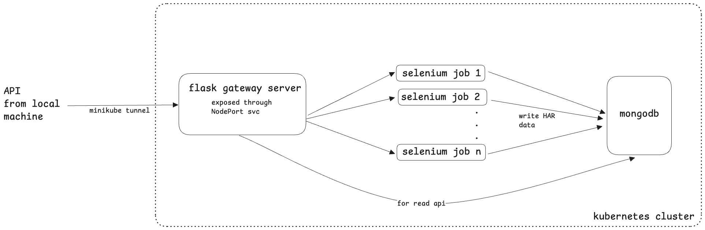

# network-scrapper

## Architecture and Design


## Description

### Gateway Service
- Python flask server to accept input for scraping via API
- When "n" inputs are given, the service creates "n" kubernetes `Job`s to execute the scraping tasks in parallel
- Also used to query and return scraped data from the database via API
### Scraping
- Selenium is used in a headless mode to scrape HAR data from the input url as a json
- The script for scraping is containerised and run as a `Job` in the kubernetes cluster
- Multiple jobs can be triggered in parallel and the output is stored in mongodb
### Data Storage
- Scraped HAR data is stored as a json in mongodb directly
- An attribute of the input URL is added for easier retrieval for the GET API
- Further optimisation to be done in the way data is stored which is mentioned at the end

## APIs and Usage
Interaction with the project is through the flask gateway server which have the below two APIs exposed:

1. API to trigger selenium scrapers
    - The body requires a list of json objects. Username and password can be blank or omitted.
    - If body contains a list of "n" objects, "n" kubernetes jobs will be parallely spawned to capture the respective HAR data
    ```
    curl --location 'http://127.0.0.1:<minikube_tunnel_port>/scrape/network' \
    --header 'Content-Type: application/json' \
    --data '[
        {
            "url": "https://google.com",
            "username": "",
            "password": ""
        }
    ]'
    ```
2. API to get the stored HAR data:
    - returns the HAR for the mentioned url as a json
    - If not present, returns null
    ```
    curl --location 'http://127.0.0.1:<minikube_tunnel_port>/get/full' \
    --header 'Content-Type: application/json' \
    --data '{
        "url": "https://google.com"
    }'
    ```

## Local Setup
1. Kubernetes setup (ignore if kubernetes cluster already exists)
    - Minikube was used for this project but the same can be deployed on any kubernetes cluster once the docker images are pushed to a remote repository
    - install minikube - `brew install minikube`
    - install docker desktop and cli
    - start the kubernetes cluster - `minikube start`
    - switch to using docker of the minikube env so that local docker images can be used directly without pushing to a remote repository - `eval $(minikube docker-env)`
    - setup kubectl and create a namespace `scrapper` (used for all the project related deployments)

2. build docker image for flask gateway server
    ```
    docker build -t network-scapper:latest -f app/Dockerfile .
    ```

3. build docker image for selenium job
    ```
    docker build -t network-scapper-selenium-job:latest -f job/Dockerfile .
    ```

4. apply deployment file for flask gateway server
    ```
    kubectl -n scrapper apply -f app/deployment-svc.yaml
    ```

5. apply role bindings to allow flask gateway server to create jobs in the same kube namespace
    ```
    kubectl -n scrapper apply -f role.yaml
    kubectl -n scrapper apply -f role-binding.yaml
    ```
6. setup standalone mongo instance
    ```
    kubectl -n scrapper apply -f mongo/deployment.yaml
    ```
7. start service tunnel on minikube to access flask gateway server (if using minikube)
    ```
    minikube service flask-gateway-server -n scrapper
    ```

## Connect to Mongo instance:
pre requisite - `brew install mongosh`

1. `kubectl -n scrapper port-forward service/mongo 27017:27017`
2. `mongosh -u admin -p password --authenticationDatabase admin`


## Future improvements

### Data storage
- The HAR data is being directly stored into mongodb currently. This is infesible at scale due to potential size of the overall database and also the size of each document (max of 16 MB)
- Based on how the data needs to be used and the query patterns, we can do one of the following:
    - If data needs to be read rarely:
        - use a blob storage to store the HAR json and store a reference to the file along with the input url in mongo
    - If data needs to be read frequently:
        - If entire document needs to be read together:
            - blob storage can be used here as well
            - or GridFS from mongodb can be used
        - If document should be queried in parts:
            - `entries` array from the HAR can be stored as individual documents with adding a property for the input url. This would help break the HAR into smaller documents, query individual entries of the HAR or get all the entries for a given input url

### Remote docker images
- To replicate the project more easily, the docker images for flask-gateway-server and selenium-job can be pushed to remote registries and pulled from there